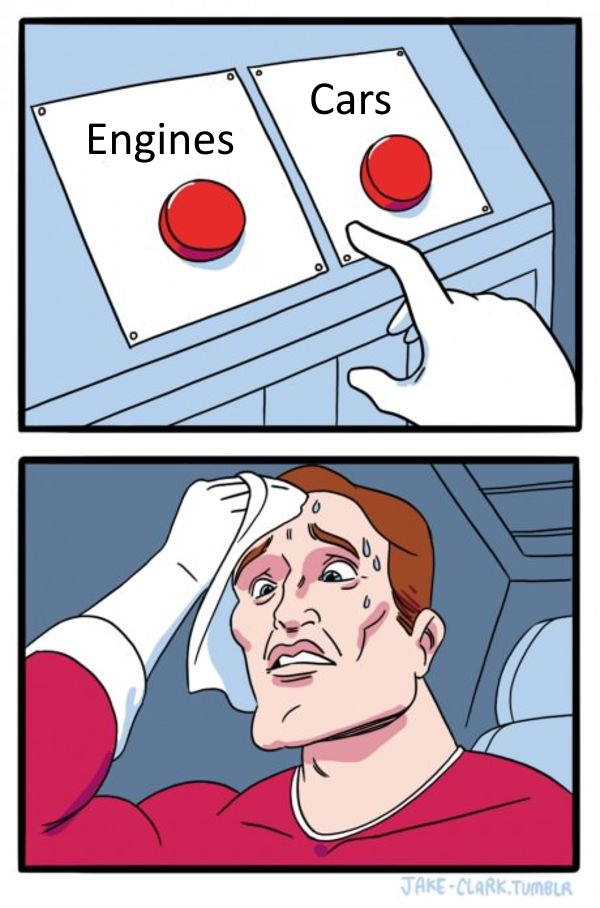

# Industry Realism

**Tested With V3 Version: 1.6.2**

- Reworks buildings that have multiple potential outputs to only have one primary output
  - Except shipyards. Why? Shipyards represent a technological progression. All of the other buildings represent _two separate outputs_ that should be coming from two separate factories.
- Creates a new building type for the alternate outputs
- Some building inputs were changed to be more historically accurate
- Places those new buildings in appropriate states on the starting map
- Updates companies and events around those buildings in ways that hopefully make sense
- Adds some buildings for artificially creating oil and rubber, quite far in the tech tree, to make playing tall more viable

### Full list of building changes:

- Food Industry: now only produces groceries
- Distillery: new building uses sugar to produce rum, or grain to produce grain alcohol (vodka, beer, sake, etc.), both represented by generic "liquor" good
- Textile Mills: now only produces normal clothing
- Tailoring Workshop: new building produces luxury clothing
- Furniture Manufacturies: now only produces normal furniture
- Luxury Furniture Manufacturies: new building produces luxury furniture
- Glassworks: now only produces glass
- Pottery Mills: new building produces porcelain
- Synthetics Plants: now called dye plants, they produce dye from coal
- Rayon Plants: new building, produces synthetic silk from wood
- Motor Industry: now only makes engines
- Automobile Factory: new building, makes automobiles from engines, oil, rubber, and steel
- War Machines Industry: now only makes tanks
- Aircraft Industry: new building, makes aeroplanes
- Electrics Industry: renamed to Telephone Industry, now only makes telephones
- Radio Industry: new building, makes radios
- All Farms: no longer have the option to produce fruit
- Rye Farms: no longer magically produce potatoes
- Fruit Orchards: new farm building, produces fruit
- Livestock Ranches: now only produce meat and a small amount of fertilizer. input goods have also been rebalanced. cows and pigs eat a lot.
- Wool Farms: new building, produces fabric and a small amount of fertilizer
- Logging Camps: now only produce wood
- Hardwood Logging Camps: new building, produces half wood and half hardwood. some logging camps were converted to hardwood logging camps, based on realistic locations
  - These require the region to have hardwood forests. Forestry data taken from [Britannica](https://kids.britannica.com/students/assembly/view/56196)
  - I would've preferred if there was a way to convert hardwood to be used as wood, but that's only possible for pop needs, not construction. Therefore, these still produce half normal wood. For game balance reasons.
- Synthetic Rubber Plants: new building, unlocks from Plastics, produces rubber from liquor and sulfur ([historical precedent](https://en.wikipedia.org/wiki/Polybutadiene#History))
- Synthetic Fuel Plants: new building, unlocks from Electric Arc Process, produces oil from coal and iron ([historical precedent](https://en.wikipedia.org/wiki/Fischer%E2%80%93Tropsch_process#History))

### Other Tweaks

- Stop the autonomous queue from building Power Plants. This is only needed because they spam them out with 8 in one state at a time. Until this bug is fixed, it's better to just leave it to government construction.
- Stop the AI from subsidizing buildings other than Railways. Most buildings do just fine with the free market at work.
- Improves auto-expand rules
- Make the AI prioritize building gold mines

### Why no synthetic this or that?

There simply wasn't historic precedent for things such as synthetic coffee, tea, or opium. Synthetic opiates, for example, were not invented until 1960, which does not fit the timeframe of the game.

### Industry Expanded exists, why waste time on this?

I wanted a mod that does not introduce any new goods. Industry Expanded is a great mod, it's simply not what I'm looking for. I wanted something lighter weight. You're free to choose whichever one you prefer.

### Compatibility

This mod is compatible with most mods that do not touch the buildings above or alter the start locations of buildings on the map.

- Verified compatible with BPM.
- There are compatches for use with Ultra Historical.
  - [UH: Politics Compatch](https://steamcommunity.com/sharedfiles/filedetails/?id=3214936638)
  - [UH: Demographics Compatch](https://steamcommunity.com/sharedfiles/filedetails/?id=3214936381)
- Incompatible with Industry Expanded, for obvious reasons.
- Partial compatibility with VTM. Load it after VTM and this mod will work, though it will override some of VTM's changes. A compatch would be necessary for full compatibility.

TODO:

- Translations
- Add links to the compatches
